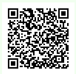

# Minimalist

**`Author:`** [Cynex](https://github.com/cynex-k)

## Description:
> I removed all the... unnecessary parts of my PNG file.
   Can you still display it?
   NOTE: width = 154.
## Attachment:
[Chall](../chall.bin)

## Solution:
If we run the `file` command to what we are given 
```
cynex@kali:~/challengs/forensics/Minimalist$ file chall.bin 
chall.bin: data
```
we get nothing now try with `xxd` command (xxd - make a hexdump or do the reverse.)
```
cynex@kali:~/challengs/forensics/Minimalist$ xxd chall.bin
00000000: 0000 0372 4944 4154 78da edda db51 0331  ...rIDATx....Q.1
00000010: 0c05 d0ed bf59 860a 4207 0c2b 5d3f b08f  .....Y..B..+]?..
00000020: 265f 4092 8d8f 89d6 929e efcf 97c7 318f  &_@...........1.
00000030: c712 e0f4 c0e9 81d3 a3ce f911 ff33 70e2  .............3p.
00000040: 1438 054e 8113 274e 9c02 a7c0 2970 e2c4  .8.N..'N....)p..
00000050: 792d e7d3 8b57 affc 9737 4d5d ea2f 4fff  y-...W...7M]./O.
00000060: e527 af7e 155f 319c 3871 dec0 f9ea cbfd  .'.~._1.8q......
00000070: d5b3 966c 94e6 a748 bd45 ed59 3871 e2bc  ...l...H.E.Y8q..
00000080: 81f3 2f4b 3c21 1d36 d358 737b 4d58 319c  ../K<!.6.Xs{MX1.
00000090: 3871 e28c 5c5c 2a1d d652 542d 4f37 0f3c  8q..\\*..RT-O7.<
...
...
```
we see the key word `IDAT` so it is a chunk of PNG file.
Since we don't have the height we can't build the png file instead we will extract the data from this chunk 
PNG IDAT chunk use zlib compression to compress the data and stors inside the rgb value with the filter bit 
What we need to do is decompress the idat chunk then remove the filter bit using the width that we are given (please refer to the [helloPNG](../../HelloPNG/solution) writeup to understand the filter )then make new image with rgb value
I made a python script with the help of `PIL` library 
```python
import zlib 
from PIL import Image

# read the IDAT chunk 
chunk = open("chall.bin","rb").read()

# extract the size of the chunk
size = int(chunk[:4].hex(),16)

# extrcat the chunk data
chunk_data = chunk[8:size+8]

# decompress the data with zlib
uncompres = zlib.decompress(chunk_data)

# Remove the filter bit 
rgb = b''
j =0
for i in range(len(uncompres)):
    if i == j*463:
        j+=1
    else:
        rgb +=int.to_bytes(uncompres[i])

# Prepare the RGB values
pixels = []
for i in range(0,len(rgb),3):
    pix = (int(rgb[i:i+1].hex(),16),int(rgb[i+1:i+2].hex(),16),int(rgb[i+2:i+3].hex(),16))
    pixels.append(pix)


# Build the image
width = 154
height = j
img = Image.new('RGB', (width, height))

# embed the pixels value inside the image
img.putdata(pixels)

# Save the image to a file
img.save('chall.png')
```

After running the script we get this image:

 

scan the QR code or using the `zbarimg` commad in linux to get the flag

## Flag:
AlphaCTF{NOw_you_Kn0W_H0w_TO_DE4l_w17H_idaT_CHUnK_aND_Zl1B_ComPrEs$i0N}
