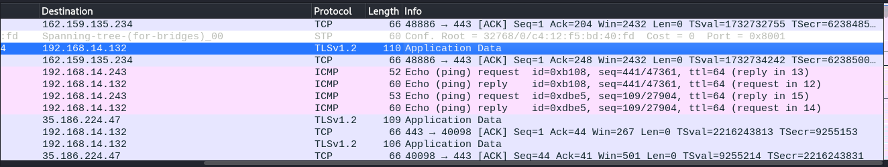
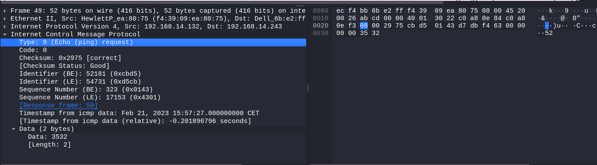
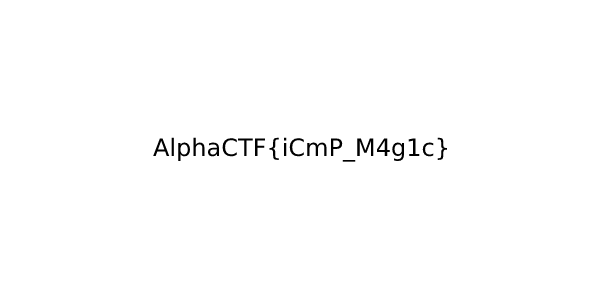

# Traffic

**`Author:`** [Cynex](https://github.com/cynex-k)

## Description
  > we captured this weird comunications
  > can you investigate what is happening here...... 

### Attachment
[chall.pcapng](../chall.pcapng)

## Solution:

First look to the pcap file with wireshark we see a lot of icmp packets so we apply the filter icmp 

After that we note that each icmp packet has at least 3 byte if we try to enumerate the data and decode it with ascii table 

I have write a small script to convert the data to ascii but first we need to dump data from the pcap and I do that with `tshark` command 
```
tshark -r chall.pcapng  -Y "icmp.type== 8" -Tfields -e "data" |  sed 's/../& /g;s/ $//' > data
```
sed command is just to add space between number 
```
before sed : 3536
after sed  : 35 36
```

then this script:
```python
f = open("data","r")
ter = False
while not ter:
	asc = f.readline().split()
	num = ""
	for i in asc:
		num += chr(int(i,16))
	try:
		print(chr(int(num)),end="")
	except:
		ter = True
f.close()
```
and it gives us this output: 
```
AlphaCTF{060ad92489947d410d897474079c1477}AlphaCTF{3e04873f1179f0d77767caf6f79416b3}AlphaCTF{79eb1bf6872845080574bee2ed56b86d}AlphaCTF{7c7409db65f8ff5bec078fd02d5de8d4}AlphaCTF{65a90070ad09e95403d454c0d17ee12b}AlphaCTF{1de4347eb5dcdb0f9addeb271725a506}AlphaCTF{ca1f4a7de4596979848397cc9d97de9c}AlphaCTF{358d7d89828ded802f1237178fd984bd}AlphaCTF{253f594e25dcd1057daf08cf267561a9}AlphaCTF{450e56122a0643f4350f31924e641207}AlphaCTF{19dcb24c39aa60dab989d192a0f55208}AlphaCTF{1c5a534ad7786ac4ebcc1d3e0c7276db}AlphaCTF{b277440f96b5b6da52e56c648be2d619}AlphaCTF{d4ede8817cc64ad4aef5ef7971119d1e}AlphaCTF{fc996de295b575f94a0838d1219c41ca}AlphaCTF{c860e3d5e7ccd57f7761e0a62d4ff67d}AlphaCTF{a6a1f37a326e98ecd22807c0b1b2f41c}AlphaCTF{e10ea7251ab94045244f8bb8fbcf697f}AlphaCTF{425361ad8c397f9bde3eef8f9277a417}AlphaCTF{966d71ab645a33f1fa0392dfeef76372}AlphaCTF{d8a5db3a5b6c70b1623bfd5e9ddfea9a}AlphaCTF{a84bda35469ef3e0a5eff09345cb5882}AlphaCTF{95cd636efcab44b2f56cf849ff12d3c6}AlphaCTF{5a72b5077e24763eba270cb99e4ca471}AlphaCTF{679b
```

So obviously this not our flag we need to think again 

Now if you look closely to the other fields `sequence` and `id` in the icmp header we see that sequence aren't ordered but if we look to the packet with the sequence equal to 1

we notice in the id field `0x8950` and it is similar to the Magic Code of PNG which start with this sequence `89504e470d0a1a0a`. So may be the png is the flag
we need to dump the id but in order we can do that with this command :
```
tshark -r chall.pcapng  -Y "icmp.type== 8" -Tfields -e "icmp.seq" -e "icmp.ident"  | sort -V > data
```

```
from man page of sort :
	-V  -- sort version numbers 
```

we get the data file : 
```
0       35152
1       20039
2       3338
3       6666
4       0
5       13
6       18760
7       17490
8       0
9       600
10      0
11      300
12      2051
13      0
14      40
15      58173
16      41984
17      0
18      371
19      21063
20      16897
21      55753
22      11391
...
...
```
we can get rid of the sequence after the sorting 
```
cat data | cut -d " " -f2 > id_data
```

we need to convert numbers to hexadecimal then to byte to build the PNG image 

I wrote this script to export the PNG image:

```python
f = open("id_data","r")
g = open("flag.png","wb")
finish = False
png_data = ''
while not finish:
	decimal = f.readline()
	if decimal == '':
		finish=True
		break
	#convert to int
	decimal = int(decimal)
	#convert to hex
	hexa = hex(decimal)[2:]
	png_data +=hexa.zfill(4)
f.close()
g.write(bytes.fromhex(png_data))
g.close()
```
after running the script we will have the flag png 



## Flag
`AlphaCTF{iCmP_M4g1c}`
