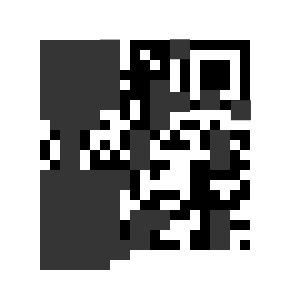

**`Author:`** [Cynex](https://github.com/cynex-k)

## Description

In a high-security facility, there's a computer system that controls access to the most sensitive data in the world. To protect against hackers and spies, the system uses a complex encryption algorithm that changes every hour. But one day, an intruder managed to break into the facility and steal a crucial part of the algorithm.

The stolen data was stored on a small device that the intruder hid somewhere in the city. To recover the data and prevent a catastrophic breach, the authorities need your help. They have intercepted a message from the intruder that contains a QR code, which they believe is a clue to the location of the device.

Your mission, should you choose to accept it, is to decode the QR code and find the device before it falls into the wrong hands. But be warned, the intruder is watching your every move and will stop at nothing to keep the data hidden. Good luck!
## Attachment

## Solution

First of all the challenge is broken my intended way is to follow along this [steps](https://github.com/pwning/public-writeup/blob/master/mma2015/misc400-qr/writeup.md) to get a clear idea QR code work and how they can recover the loss of data 
but CTF players found this online [Tool](https://merricx.github.io/qrazybox/) to use it for decoding the Qr Code 
all you have to do is draw the Qr code in the project (black and white) and leave the Gray mask as it is then in the tools section we choose the Reed-Solomon Decoder tool 
hit decode and it will print the decoded string 

## Flag
AlphaCTF{Qr_D3c0d3_!}

