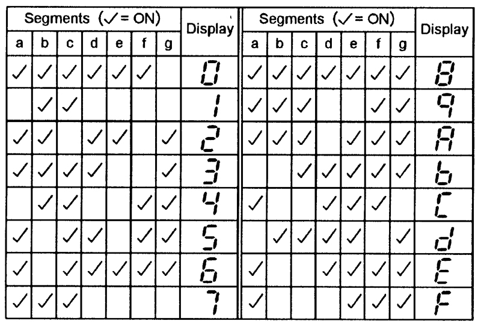

# Vagueness

**`Author:`** [Cynex](https://github.com/cynex-k)

## Description:

> We are a company that made embedded system we are suspecting that there is a spy among us who is leaking our product but we did not get  a proof, until one day we get this message we believe that is some password used for encrypt communication between the spy and his organization help us recover this password
NOTE: the flag format : AlphaCTF{Decoded_message}
> 

## Attachment:


## Solution:

When we look to the description we get this keyword `embedded system` that have somthing in common with the PNG file we have 
The Secret is written with the 7 segment font and this a hint for decode the message

a little research about 7 segment we fond this:



so the digits are encoded with 7 bit. So if convert the digits to binary according to this table we will get numbres that we can convert it with the ASCII table 
I have write a small python script for encoding and decoding

  

```python
#!/usr/bin/python

def main():
#encoded_flag = E179623624C6434961C6236973    
    transformation_table = {
        0x7e: '0', 0x30: '1', 0x6d: '2',
        0x79: '3', 0x33: '4', 0x5b: '5',
        0x5f: '6', 0x70: '7', 0x7f: '8',
        0x73: '9', 0x77: 'A', 0x1f: 'b',
        0x4e: 'C', 0x3d: 'd', 0x4f: 'E',
        0x47: 'F'}

    dec = input("what do you want (encode/decode)? \nYour answer: ")
    if dec == 'encode':
        buf = input("[*] message > ")
        print('[*] Encoded message: ',end="")
        for i in range(len(buf)):
            asci = ord(buf[i])
            print(transformation_table[asci], end="")
    elif dec == 'decode':
        buf = input("[*] Encoded message > ")
        for i in range(len(buf)):
            for j in transformation_table:
                if buf[i] == transformation_table[j]:
                    print(chr(list(transformation_table.keys())[
                          list(transformation_table.values()).index(buf[i])]), end="")
    else:
        print('invalid choice')
        return

if __name__ == "__main__":
    main()
```

we run the script with this input : `E179623624C6434961C6236973`

and we get this string : `O0ps_my_m3N_3y3s_0N_my_spy`

## Flag:

AlphaCTF{O0ps_my_m3N_3y3s_0N_my_spy}
